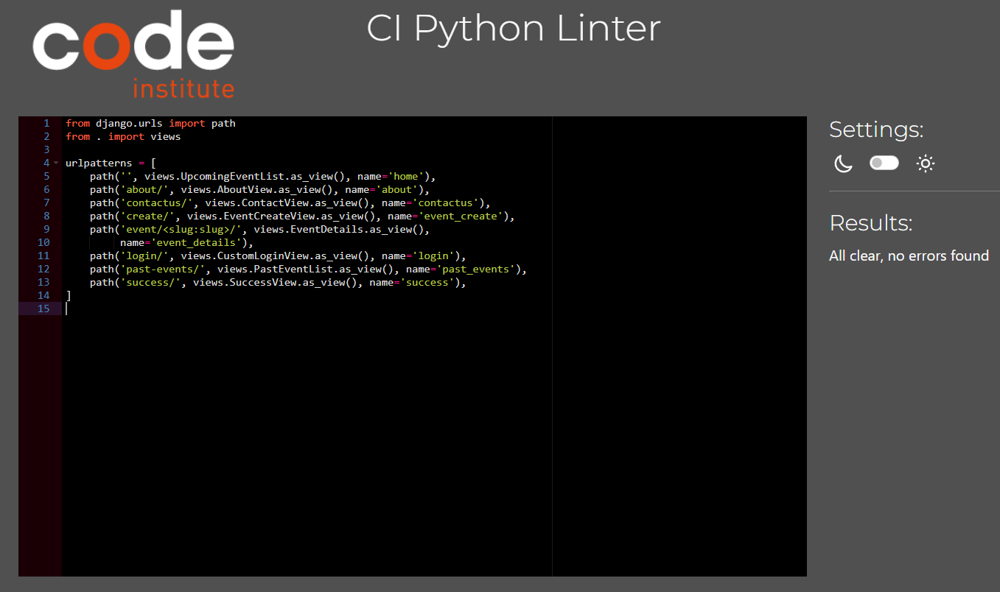

# Event Ease

EventEase is a dynamic event management web application built with Django. It is designed to streamline the creation, registration, and communication around events through a user-friendly interface. The project is structured to run on a Django server with Bootstrap integration for responsive design and an engaging user experience.

The platform allows users to browse upcoming events, view detailed event information, and register for events with personalized notes. Authenticated users can also create new events, which are subject to an approval process before becoming publicly visible. Additionally, a contact form enables visitors to reach out to the site administrators with inquiries or feedback.

This project demonstrates key Django functionalities such as class-based views, forms, form validation, session-based authentication, and model-driven development. It also emphasizes best practices in web development, including modular test design, clean form handling, and conditional UI elements based on user interaction.

EventEase offers a practical solution for managing community or organizational events and highlights the capabilities of Django in building scalable and maintainable web applications.

## Project Goals

The primary goal of developing EventEase was to build a fully functional event management web application using Python, Django, PostgreSQL, Bootstrap, and HTML/CSS. This project served as a platform to:

- Strengthen Django Web Development Skills: Apply key concepts such as class-based views, form handling, model relationships, and template rendering in a real-world context.

- Implement Object-Oriented Design: Use Django’s model-view-template architecture and class-based views to ensure modular, maintainable, and scalable code.

- Enhance User Experience in the Browser: Focus on intuitive navigation, clean layout, and responsive design using Bootstrap and conditional rendering based on user authentication.

- Enable Meaningful User Interaction: Provide users with the ability to browse, register for, and create events, along with a contact form for feedback and inquiries.

- Deliver a Practical and Purpose-Driven Application: Address common event coordination needs with a polished, user-centered solution that demonstrates full-stack web development proficiency.

## How to Use EventEase

EventEase is designed to be intuitive and accessible for users who want to explore, register for, or organize events. Here's how you can interact with the platform:

### Browse Events

- From the homepage, users can view a list of upcoming approved events.

- Each event card displays key details like title, date, and location.

### View Event Details

- Click on any event to view full details, including time, description, location, and available registration options.

### Register for an Event

- Logged-in users can register for events by submitting a short note.

- Registrations can later be updated or canceled directly from the event details page.

### Create an Event

- Authenticated users can access the "Create Event" page to propose a new event.

- Once submitted, the event will be pending approval and hidden from the public list until approved by the administration.

### Contact the Organizers

- Anyone can use the contact form to send questions or feedback.

- Upon successful submission, users are redirected to a confirmation page.

## Technologies used

- **Python**: The core programming language used to build the backend logic of the application via Django.

- **Django**: A high-level Python web framework used to handle routing, authentication, form processing, and database interaction.

- **PostgreSQL**: A powerful relational database used to store event data, user registrations, and contact messages.

- **HTML5 & CSS3**: Used for structuring and styling the frontend templates.

- **Bootstrap 5**: A CSS framework used to ensure responsive design and consistent UI components across the site.

- **Git & GitHub**: Git was used for version control, and GitHub served as the remote repository for collaboration and backup.

- **VS Code**: The primary code editor used throughout development, offering useful tools like syntax highlighting and extensions.

- **Heroku**: Used for live deployment of the application.

## Features

### Existing Features

- **Event Listing**: Browse a list of upcoming approved events with key details like date, location, and title.

- **Event Detail View**: View full event information including time, description, and available actions.

- **User Registration**: Authenticated users can register for events and leave a personalized note.

- **Update or Cancel Registration**: Registered users can edit or delete their event registrations.

- **Event Creation**: Logged-in users can create new events, which remain hidden until approved.

- **Contact Form**: A simple form allows any user to send questions or feedback to site administrators.

- **Authentication**: Secure login and signup functionality for users.

- **Form Validation**: All user inputs are validated for completeness and accuracy.

- **Success Messages**: Users receive confirmation after creating or registering for events or contacting the admin.

- **Responsive Design**: Fully responsive layout using Bootstrap for mobile and desktop devices.

### Future Features

- **Admin Dashboard**: Interface for staff to approve, reject, or manage events and registrations.

- **User Profile Page**: Display a user's registered and created events in one place.

- **Search & Filter**: Enable filtering of events by category, date, or location.

- **Event Comments or Reviews**: Let users comment on or rate events.

- **Calendar View**: A visual calendar for exploring events by date.

## Testing

### Automated Testing

Automated testing was implemented using Django's built-in TestCase framework to ensure that key components of the application work as expected. Tests were organized by feature and written to validate the core functionality and logic of the app.

Test coverage includes:

- **EventCreateForm**: A comprehensive suite of unit tests was written for the EventCreateForm to ensure robust form validation and behavior. These tests verify both successful and unsuccessful form submissions under various conditions. Tests covered:

  - Valid Submission: Confirms the form accepts correct input with or without an image.
  - Required Field Validation:
    - Missing title results in a validation error.
    - Missing description results in a validation error.
    - Missing date, time, or location each independently trigger validation errors.

- **EventRegistrationForm**: Unit tests were implemented for the EventRegistrationForm, which allows users to register for an event with an optional note. Tests Covered:
  - Valid Submission with Note: Confirms that the form is valid when a note is provided by the user.
  - Valid Submission without Note: Verifies that the form remains valid when the note field is left empty, since it's optional.

- **ContactForm**: Unit tests were created for the ContactForm, which allows users to send messages to the site administrators via the contact page. Tests covered:
  - Valid Submission: Ensures the form is valid when all required fields (name, email, message) are correctly provided.
  - Missing Fields:
    - Missing name: Triggers a validation error.
    - Missing email: Results in a validation error.
    - Missing message: Prevents form submission and returns an error.
  - Invalid Email Format: Validates that the form rejects improperly formatted email addresses.

- **UpcomingEventListView**: Unit tests were written for the view that displays upcoming events on the homepage. These tests ensure that users only see relevant, approved, and future-dated events in the correct order. Tests covered:
  - Approved & Future Events Only
    - Confirms that only events with status=1 (approved) and with a future date are listed.
    - Verifies that past events and events pending approval are excluded from the homepage.
  - Sorting Logic
    - Ensures upcoming events are sorted first by date, then by time in ascending order.

- **PastEventListView**: Unit tests were developed to ensure the proper functionality of the past events listing view, which displays previously held, approved events. Tests covered:
  - Approved & Past Events Only
    - Verifies that only events with status=1 (approved) and dates in the past are shown.
    - Ensures future events and unapproved past events are excluded from the view.
  - Sorting Logic
    - Confirms that past events are ordered by most recent first, sorted by date and time in descending order.

- **EventCreatetView**: Unit tests were written to verify the event creation view, ensuring that only authenticated users can create events and that form validation behaves as expected. Tests covered:
  - Successful Event Creation
    - Validates that submitting a properly filled form creates a new Event instance.
    - Confirms the event is correctly assigned to the authenticated user as created_by.
  - Form Validation Errors
    - Submitting the form without required fields (title, description, date, time, or location) triggers appropriate error messages.
    - Verifies that no event is created when the form contains incomplete data.

- **EventDetailsView**: Unit tests were written to validate the behavior of the event detail view, where users can view event information, register, update their registration, or cancel it. Tests covered:
  - View Event Details
    - Confirms the event detail page loads successfully and displays the correct event content.
    - Verifies that the registration form is included in the page context.
  - New Registration Submission
    - Authenticated users can submit a registration note and are redirected after success.
    - Ensures a new EventRegistration instance is created and linked to the logged-in user.
  - Update Existing Registration
    - Allows users to update their registration note using the "update_registration" flag.
    - Confirms that the note is successfully modified in the database.
  - Cancel Registration
    - Supports unregistering from an event using the "cancel_registration" flag.
    - Ensures the user’s registration is deleted from the database after submission.

- **ContactView**: Tests were implemented to validate the functionality of the contact form view, ensuring that users can successfully send messages and receive proper feedback on errors. Tests covered:
  - Form Rendering
    - Verifies that a GET request to the contact page renders the correct template and includes a valid ContactForm instance in the context.
  - Successful Submission
    - Submitting a valid form creates a ContactMessage object and stores the user's name, email, and message in the database.
  - Invalid Submission Handling
    - Tests that submitting the form with missing or invalid data (e.g., empty name, bad email format) redisplays the form with appropriate error messages.
    - Ensures that no message is saved if the input fails validation.

**Running the tests**: To run all tests locally, use the following command in your terminal: python manage.py test events.tests

### Code Institute Python Linter

models.py PEP8 Compliance

views.py PEP8 Compliance

forms.py PEP8 Compliance

admin.py PEP8 Compliance

eventease.urls.py PEP8 Compliance

events.urls.py PEP8 Compliance

env.py PEP8 Compliance

settings.py PEP8 Compliance

test-event-create-form.py PEP8 Compliance

test-event-registration-form.py PEP8 Compliance

test-contact-form.py PEP8 Compliance

test-upcoming-event-list-view.py PEP8 Compliance

test-past-event-list-view.py PEP8 Compliance

test-event-create-view.py PEP8 Compliance

test-event-details-view.py PEP8 Compliance

test-contact-view.py PEP8 Compliance

### Manual Testing

The following manual tests were conducted to ensure the core functionality and user interactions in EventEase work as intended:

- **View Upcoming Events**: Verified that all approved upcoming events are displayed correctly on the homepage, with associated images, and are sorted by date in ascending order (soonest first).

- **View Past Events**: Navigated to the past events section and confirmed that all previously held events are listed with images and sorted by date in descending order (most recent first).

- **Create New Event (Success Case)**: Logged in as a user and created a new event using valid data. Upon submission, a success page was displayed indicating the event is pending approval.

&nbsp;&nbsp;&nbsp;&nbsp;&nbsp;&nbsp;&nbsp;&nbsp;&nbsp;&nbsp; 

- **Contact the Administration (Success Case)**: Submitted the contact form with all required fields completed. A success page was shown confirming the message was sent.

&nbsp;&nbsp;&nbsp;&nbsp;&nbsp;&nbsp;&nbsp;&nbsp;&nbsp;&nbsp; 

- **Register for an Event**: Registered for an upcoming event as a logged-in user. A confirmation message was displayed in the browser, indicating successful registration.

- **Create New Event (Error Case)**: Attempted to submit the event form with missing required fields. The form returned with clear validation error messages, preventing incomplete submission.

&nbsp;&nbsp;&nbsp;&nbsp;&nbsp;&nbsp;&nbsp;&nbsp;&nbsp;&nbsp; 

- **Contact Form Submission (Error Case)**: Submitted the contact form with missing data. The page displayed field-specific error messages, prompting correction before resubmission.

&nbsp;&nbsp;&nbsp;&nbsp;&nbsp;&nbsp;&nbsp;&nbsp;&nbsp;&nbsp; 

## Deployment and development

### Cloning the project

1. Install Git: If Git is not already installed on your system, you can download it from the official Git website and follow the setup instructions specific to your operating system.
2. Create project folder `mkdir event-ease`
3. Change to the project directory `cd event-ease`
4. Clone the repository `git clone https://github.com/salah929/event-ease .`

### Running the project locally

1. Open Terminal and navigate to the cloned project folder.
2. Install Dependencies: `pip install -r requirements.txt`
3. Set Up Environment Variables: Create a .env file and add necessary environment variables (e.g., SECRET_KEY, DEBUG, DATABASE_URL).
4. Apply Migrations: `python manage.py migrate`
5. Run the Development Server: `python manage.py runserver`

### Deploying the Project to Heroku

1. Create or log into your Heroku account at [heroku.com](https://www.heroku.com).
2. Install the Heroku CLI from [devcenter.heroku.com](https://devcenter.heroku.com/articles/heroku-cli).
3. Create New App: From the Heroku dashboard, click the "New" button in the top right corner. Select "Create new app" from the drop-down menu.
4. Name and Region Selection: Choose a unique name and select the region.
5. Add buildpacks: Navigate to Buildpack and click Add Buildpack to add Python and nodejs. Ensure that the python buildpack is above the Nodejs buildpack.
6. Configure Environment Variables (in Heroku dashboard → Settings → Config Vars).
7. Create a Superuser via VS Code Terminal: `heroku run python manage.py createsuperuser`
8. Deploy from GitHub: Navigate to the "Deploy" section by clicking the "Deploy" tab in the top navbar. Select "GitHub" as the deployment method and connect your GitHub repository by searching for its name in the search bar. Click "connect" to link the repository to Heroku.
9. Deploy Branch: Scroll down and click "Deploy Branch" to initiate the deployment process. Heroku will notify you once the app is deployed, and you'll be provided with a button to view the deployed app.

## Credits

- [code institute template](https://github.com/Code-Institute-Org/python-essentials-template) to start the project
- [code institute CI Python Linter](https://pep8ci.herokuapp.com/) to check the code for PEP8 compliance